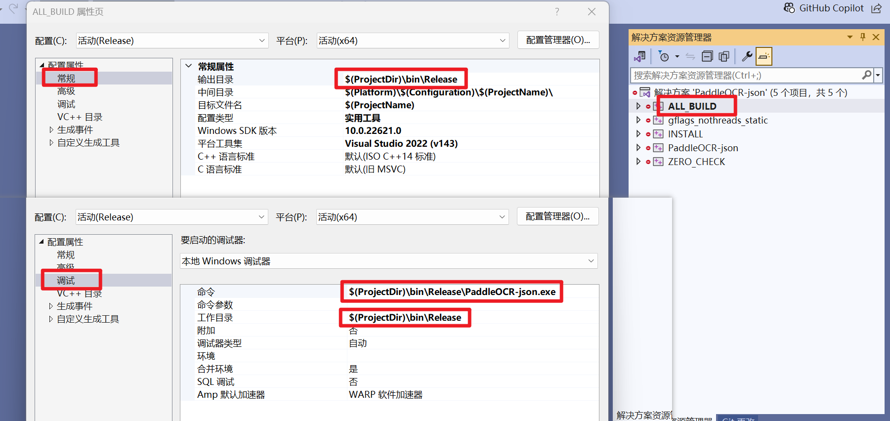

# PaddleOCR-json V1.3 构建指南

本文档帮助如何在Windows上编译 PaddleOCR-json V1.3 （对应PPOCR v2.6）。面向小白，用的最简单的步骤。大佬可酌情调整。

本文参考了 PPOCR官方的[编译指南](https://github.com/PaddlePaddle/PaddleOCR/blob/release/2.6/deploy/cpp_infer/docs/windows_vs2019_build.md#12-%E4%B8%8B%E8%BD%BD-paddlepaddle-c-%E9%A2%84%E6%B5%8B%E5%BA%93%E5%92%8C-opencv) ，但建议以本文为准。

## 1. 前期准备

资源链接后面的(括弧里是版本)，请看清楚。

### 1.1 需要安装的工具：

- [Visual Studio 2019](https://learn.microsoft.com/zh-cn/visualstudio/releases/2019/release-notes) (Community)
- [Cmake](https://cmake.org/download/) (Windows x64 Installer)
- [Git](https://git-scm.com/download/win) (64-bit Git for Windows Setup)

### 1.2 需要下载的资源：

- [paddle_inference](https://paddleinference.paddlepaddle.org.cn/user_guides/download_lib.html#windows) (Windows, C++预测库, cpu_avx_mkl)
- [Opencv](https://github.com/opencv/opencv/releases) (windows.exe)
- [模型库](https://github.com/hiroi-sora/PaddleOCR-json/releases/tag/models%2Fv1.3) (models.zip)

### 1.3 放置资源

1. clone 本仓库。在 `PaddleOCR-json/cpp` 下新建一个文件夹 `.source` 来存放外部资源。（前面加点是为了按文件名排列更顺眼）
2. 将下载好的 `models.zip` 、 `paddle_inference` 和 `Opencv` 解压进`.source`。
   - `paddle_inference` 应该解压后放入一个单独文件夹内，并且根据版本给文件夹改个后缀，比如是cpu_avx_mkl版，就叫 `paddle_inference_cpu_avx_mkl` ，以便区分。
   - Opencv看起来是个exe，实际上是个自解压包，运行并选择目录解压。

完成后应该是这样：
```
PaddleOCR-json
└─ cpp
    ├─ .source
    │    ├─ opencv
    │    ├─ models
    │    └─ paddle_inference_cpu_avx_mkl
    ├─ CMakeLists.txt
    ├─ README.md
    ├─ docs
    ├─ external-cmake
    ├─ include
    └─ src
```

## 2. 构建项目

1. cmake安装完后系统里会有一个cmake-gui程序，打开cmake-gui。在第一个输入框处填写源代码路径，第二个输入框处填写编译输出路径，见下面的模板。  
然后，点击左下角第一个按钮Configure，第一次点它会弹出提示框进行Visual Studio配置，选择你的Visual Studio版本即可，目标平台选择x64。然后点击finish按钮即开始自动执行配置。

Where is the source code: `……/PaddleOCR-json/cpp`

Where to build the binaries: `……/PaddleOCR-json/cpp/build`


执行完会报错，很正常，点OK。


2. 填写三项配置：

OPENCV_DIR 和 OpenCV_DIR:  
`……/PaddleOCR-json/cpp/.source/opencv/build/x64/vc16/lib`

PADDLE_LIB:  
`……/PaddleOCR-json/.source/paddle_inference_cpu_avx_mkl`

其他项就不要动了！


点击左下角 **第一个按钮Configure** 应用配置，等待几秒，看到输出 `Configuring done` 即可。

点击左下角 **第二个按钮Generate** 即可生成Visual Studio 项目的sln文件。看到输出 `Generating done` 即可。那么，你会看到 `PaddleOCR-json/cpp/build` 下生成了 `ppocr.sln` 及一堆文件。别急着打开！先按本文档完成后续步骤。

#### 构建失败？

如果报错中含有 `Could NOT find Git (missing: GIT_EXECUTABLE)` ，原因是电脑上未安装Git，请先安装（尽量装在默认目录下）。

如果报错中含有 `unable to access 'https://github.com/LDOUBLEV/AutoLog.git/': gnutls_handshake() failed: The TLS connection was non-properly terminated.` ，原因是网络问题，请挂全局科学上网。如果没有科学，那么可尝试将 `deploy/cpp_infer/external-cmake/auto-log.cmake` 中的github地址改为 `https://gitee.com/Double_V/AutoLog` 。

其他原因，请确认您操作的步骤与本文一致，尤其是点击按钮的先后顺序。

## 3. 配置项目

1. 在 `PaddleOCR-json/cpp/docs` 中找到 `dirent.h` ，将它拷贝到 Visual Studio 软件的 include 文件夹下。默认是 `C:/Program Files (x86)/Microsoft Visual Studio/2019/Community/VC/Auxiliary/VS/include` 。


2. 回到工程目录下的build文件夹，打开 `ppocr.sln` 。**将Debug改为Release**。


3. 调整项目字符集。在解决方案管理器的ppocr上，右键→高级→`字符集`改为`使用Unicode字符集`。


4. 按F5编译。如果输出`生成：成功2个，失败0个……`，弹窗`无法启动程序：……系统找不到指定的文件` 是正常的。但你应该能在 `build/Release` 下找到生成的 `ppocr.exe` 。请继续下面的步骤。

5. 拷贝必要的运行库。在 `.source` 中的 `paddle_inference_cpu_avx_mkl` 及 `opencv` 目录中，拷贝以下文件到 `build/Release` 文件夹下。

- `paddle_inference_cpu_avx_mkl/paddle/lib/paddle_inference.dll`
- `paddle_inference_cpu_avx_mkl/third_party/install/onnxruntime/lib/onnxruntime.dll`
- `paddle_inference_cpu_avx_mkl/third_party/install/paddle2onnx/lib/paddle2onnx.dll`
- `opencv/build/x64/vc16/bin/opencv_world470.dll`

6. 拷贝模型库。将 `.source` 中的 `models` 整个拷贝到 `build/Release` 文件夹下。

7. 在`build/Release`下，Shift+右键，在此处打开终端（或PowerShell），输入 `./ppocr.exe` 。如果输出下列文字，就正常。

```
OCR anonymous pipe mode.
OCR init completed.
```

8. 回到 Visual Studio 中，再进行一些配置。  
- 首先在 `ALL BUILD` 上，右键→属性→常规，**输出目录** 原本是 `$(SolutionDir)$(Platform)/$(Configuration)/` ，现在改成exe生成的目录，即为 `$(ProjectDir)/Release` 。  
- 其次修改工作目录，调试→工作目录，原来是`$(ProjectDir)` ，将它改为 `$(ProjectDir)/Release`。
- 然后修改生成文件名： 常规→目标文件名，改成 `PaddleOCR-json` 或你喜欢的名字。
- **解决方案中另外一个项目 `ppocr` 也要同样更改目标文件名，右键`ppocr`→属性→常规→修改目标文件名**。  




9. 尝试按F5重新编译。如果成功生成，并且有一个命令行窗口一闪而过，那就说明配置正确了。

如果你需要移植其他平台，可以参考文档 [移植指南](docs/移植指南.md)
