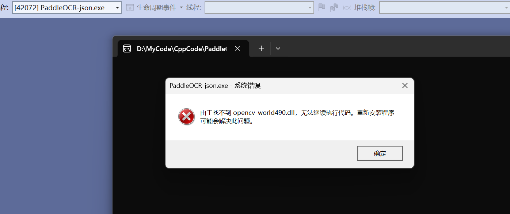

# PaddleOCR-json V2 编译指南

本文档帮助如何在Windows上编译 PaddleOCR-json V2 （对应PPOCR v2.6）。面向小白，用的最简单的步骤。大佬可酌情调整。

参考了 PPOCR官方的[编译指南](https://github.com/PaddlePaddle/PaddleOCR/blob/release/2.6/deploy/cpp_infer/docs/windows_vs2019_build.md#12-%E4%B8%8B%E8%BD%BD-paddlepaddle-c-%E9%A2%84%E6%B5%8B%E5%BA%93%E5%92%8C-opencv) 。

## 1. 前期准备

资源链接后面的(括弧里是版本)，请看清楚。

### 1.1 需要安装的工具：

- [Visual Studio 2019](https://learn.microsoft.com/zh-cn/visualstudio/releases/2019/release-notes) (Community)
- [Cmake](https://cmake.org/download/) (Windows x64 Installer)

### 1.2 需要下载的资源：

- [paddle_inference](https://paddleinference.paddlepaddle.org.cn/user_guides/download_lib.html#windows) (Windows, C++预测库, cpu_avx_mkl)
- [Opencv](https://github.com/opencv/opencv/releases) (windows.exe)
- 本项目源码
- [dirent.h](docs/dirent.h)

### 1.3 解压资源

1. 创建一个项目文件夹 `PaddleOCR-json` ，里面再创两个文件夹： `source` 和 `vs` 。
2. 将下载好的 `paddle_inference`、`Opencv`、`PaddleOCR源码`解压进`source`。（Opencv看起来是个exe，实际上是个自解压包。）

完成后应该是这样：
```
PaddleOCR-json
  ├─ source
  │   ├─ PaddleOCR
  │   ├─ opencv
  │   └─ paddle_inference
  └─ vs
```

## 2. 构建项目

1. cmake安装完后后系统里会有一个cmake-gui程序，打开cmake-gui，在第一个输入框处填写源代码路径（source中），第二个输入框处填写编译输出路径（vs中）。如下：（改成你自己的目录）

Where is the source code: `……工程目录/Source/PaddleOCR/deploy/cpp_infer`

Where to build the binaries: `……工程目录/Source/PaddleOCR/deploy/cpp_infer`


2. 点击界面下方的Configure按钮，第一次点击会弹出提示框进行Visual Studio配置，如下图，选择你的Visual Studio版本即可，目标平台选择x64。然后点击finish按钮即开始自动执行配置。之后会报错，正常，点OK。


3. 填写一些配置：（注意改成你自己的目录）

OPENCV_DIR 和 OpenCV_DIR: `……工程目录/source/opencv/build/x64/vc16/lib`

PADDLE_LIB: `……工程目录/source/paddle_inference`


点击 `Configure` 应用配置，看到输出 `Configuring done` 即可。（注意分清该点哪个按钮，不要点错了！）

4. 点击`Generate`按钮即可生成Visual Studio 项目的sln文件。看到输出 `Generating done` 即可。那么，你会看到 `……工程目录/vs` 下生成了 `ppocr.sln` 及一堆文件。

## 3. 配置项目

1. 还记得之前下载过的 [dirent.h](https://paddleocr.bj.bcebos.com/deploy/cpp_infer/cpp_files/dirent.h) 吗？将它拷贝到 Visual Studio 软件的 include 文件夹下，如 `C:\Program Files (x86)\Microsoft Visual Studio\2019\Community\VC\Auxiliary\VS\include` 。


2. 回到工程目录下的vs文件夹，打开 `ppocr.sln` 。按F5编译。如果弹窗`无法启动程序：……系统找不到指定的文件` 是正常的。但你应该能在 `vs/Release` 下找到生成的 `ppocr.exe` 。请继续下面的步骤。

3. 拷贝必要的运行库。在下载解压好的 `source/paddle_inference` 及 `opencv` 文件夹中，拷贝以下文件到 `vs/Release` 文件夹下。

- `paddle_inference/paddle/lib/paddle_inference.dll`
- `paddle_inference/third_party/install/onnxruntime/lib/onnxruntime.dll`
- `paddle_inference/third_party/install/paddle2onnx/lib/paddle2onnx.dll`
- `opencv/build/x64/vc16/bin/opencv_world470.dll`

4. 在`vs/Release`下，Shift+右键，在此处打开终端（或PowerShell），输入 `./ppocr.exe` 。如果输出下列文字，就正常。

`Usage[det]: ./ppocr --det_model_dir=/PATH/TO/DET_INFERENCE_MODEL/ --image_dir=/PATH/TO/INPUT/IMAGE/`

5. 回到 Visual Studio 中，再进行一些配置。  
- 首先在 `ALL BUILD` 上，右键→属性→常规，**输出目录** 原本是 `$(SolutionDir)$(Platform)\$(Configuration)\` ，现在改成exe生成的目录，即为 `$(ProjectDir)\Release` 。  
- 其次修改工作目录，高级→工作目录原来是`$(ProjectDir)` ，将它改为 `$(ProjectDir)\Release`。
- 然后修改生成文件名： `ALL BUILD` 的 **目标文件名** 改成 `PaddleOCR-json` 或你喜欢的名字。 `ppocr` 也要同样操作，右键`ppocr`→属性→常规→修改相同的 **目标文件名** 。  




6. 尝试按F5重新编译。如果成功生成，并且有一个命令行窗口一闪而过，那就说明配置正确了。